# Quiz Game — Data Model (ERD)

Entity-relationship map of the Prisma schema (`apps/api/prisma/schema.prisma`).

```mermaid
erDiagram
    User ||--o| AcquisitionSource : "captured on signup"
    User ||--o{ User : "referred by (self-rel)"
    User ||--o{ Round : plays
    User ||--o{ ScoreEvent : earns
    User ||--o{ LeagueMembership : "enrolled in"
    User ||--o{ PrizeAward : wins
    User ||--o| Referral : owns
    User ||--o| ReferralAttribution : "attributed to"
    User ||--o{ QuestCollection : collects

    Round ||--o{ RoundQuestion : "has (snapshot)"
    Round ||--o{ ScoreEvent : "scored in"
    Question ||--o{ RoundQuestion : "served as"

    League ||--o{ LeagueMembership : groups
    Prize  ||--o{ PrizeAward : granted

    Referral ||--o{ ReferralAttribution : produces
    Quest    ||--o{ QuestCollection : "collected as"

    GameConfig {
        string id "singleton"
        int gameDurationSeconds
        json difficultyMix "[{difficulty,count}]"
        json pointsPerDifficulty "[{difficulty,points}]"
        int roundBonus
        int referralBonus
    }

    User {
        string id PK
        string phone UK
        bool isAdmin
        string referredById FK "self"
    }
    Question {
        string id PK
        string text
        json choices "string[4]"
        int correctIndex
        bool isActive
    }
    Round {
        string id PK
        string userId FK
        enum status "IN_PROGRESS|FINISHED|ABANDONED"
    }
    RoundQuestion {
        string id PK
        string roundId FK
        string questionId FK
        int answeredIndex
        bool isCorrect
    }
    ScoreEvent {
        string id PK
        string userId FK
        string roundId FK "nullable"
        int points
        enum reason "CORRECT_ANSWER|ROUND_BONUS|REFERRAL_CREDIT|ADMIN_ADJUSTMENT|QUEST_REWARD"
        string weekKey "e.g. 2026-W29"
    }
    League {
        string id PK
        string name
        int tier
    }
    LeagueMembership {
        string id PK
        string userId FK
        string leagueId FK
        string weekKey
        int rankAtClose "set by weekly close"
    }
    Prize {
        string id PK
        int rankFrom
        int rankTo
        bool weekScope
    }
    PrizeAward {
        string id PK
        string userId FK
        string prizeId FK
        string weekKey
        enum status "PENDING|FULFILLED|CANCELLED"
    }
    Referral {
        string id PK
        string code UK
        string ownerUserId FK,UK
        int uses
    }
    ReferralAttribution {
        string id PK
        string referralCode FK
        string newUserId FK,UK
    }
    Quest {
        string id PK
        enum type "CHALLENGE|ACTION"
        int rewardScore
        int targetScore "CHALLENGE"
        enum verify "NONE|REFERRAL_SIGNUPS"
        int verifyTarget
        datetime deadline
    }
    QuestCollection {
        string id PK
        string userId FK
        string questId FK
        int awardedScore
    }
```

Renders automatically on GitHub, in VS Code (Mermaid extension), or at <https://mermaid.live>.

## How the pieces fit

**Identity & acquisition**

- **User** — one account per phone. `isAdmin` flags the single management account. `referredById` is a self-relation (who invited them).
- **AcquisitionSource** — UTM / landing / referral-code capture, 1:1 with the user who signed up.

**Gameplay**

- **GameConfig** — one singleton row of admin-editable settings (timer, questions/round, points).
- **Question** — the bank. `choices` is a 4-item JSON array; `correctIndex` 0–3. Soft-deleted via `isActive`.
- **Round** — one play session per user. **RoundQuestion** snapshots which questions were served + how they were answered (so history survives even if a Question is later edited/deactivated).

**Scoring (source of truth)**

- **ScoreEvent** — append-only ledger. Every point comes from here (correct answers, round bonus, referral credit, quest reward, admin adjustment), stamped with `weekKey`. Redis sorted sets are just a rebuildable cache of this.

**Leagues & prizes**

- **League** — a daily-period leaderboard (`[startsAt, endsAt)`), optionally bound to an `isOverall`
  campaign via `parentLeagueId`. `roundAllowance` caps rounds per player (+ `RoundGrant`s).
  Tiered Bronze/Silver/Gold leagues are retired (`LeagueMembership` is vestigial).
- **Prize** (a rank range like 1–1) ↔ **PrizeAward** (who won it, which period, fulfillment status).

**Referrals**

- **Referral** — each user's shareable code. **ReferralAttribution** — one row per invited user who actually signed in.

**Quests**

- **Quest** — collectible task (CHALLENGE = earn points; ACTION = external, optionally auto-verified by referral signups). **QuestCollection** — one row per user+quest once collected (also writes a `QUEST_REWARD` ScoreEvent).

## Notes

- `||--o{` = one-to-many, `||--o|` = one-to-(zero-or-)one, `PK`/`FK`/`UK` = primary/foreign/unique key.
- `weekKey` is the period filter column — despite the name it now holds a **day** (`YYYY-MM-DD`, UTC),
  scoping everything "daily" vs. "overall" with no separate tables.
- The Prisma schema (`apps/api/prisma/schema.prisma`) is the source of truth; this ERD is a curated view.
