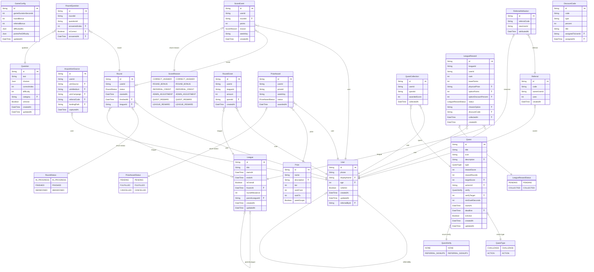

```mermaid
erDiagram

        RoundStatus {
            IN_PROGRESS IN_PROGRESS
FINISHED FINISHED
ABANDONED ABANDONED
        }
    


        ScoreReason {
            CORRECT_ANSWER CORRECT_ANSWER
ROUND_BONUS ROUND_BONUS
REFERRAL_CREDIT REFERRAL_CREDIT
ADMIN_ADJUSTMENT ADMIN_ADJUSTMENT
QUEST_REWARD QUEST_REWARD
LEAGUE_REWARD LEAGUE_REWARD
        }
    


        PrizeAwardStatus {
            PENDING PENDING
FULFILLED FULFILLED
CANCELLED CANCELLED
        }
    


        QuestType {
            CHALLENGE CHALLENGE
ACTION ACTION
        }
    


        QuestVerify {
            NONE NONE
REFERRAL_SIGNUPS REFERRAL_SIGNUPS
        }
    


        LeagueRewardStatus {
            PENDING PENDING
COLLECTED COLLECTED
        }
    
  "User" {
    String id "🗝️"
    String phone 
    String displayName "❓"
    Int age "❓"
    Boolean isAdmin 
    DateTime createdAt 
    DateTime updatedAt 
    String referredById "❓"
    }
  

  "AcquisitionSource" {
    String id "🗝️"
    String userId 
    String utmSource "❓"
    String utmMedium "❓"
    String utmCampaign "❓"
    String referralCode "❓"
    String landingPath "❓"
    DateTime capturedAt 
    }
  

  "GameConfig" {
    String id "🗝️"
    Int gameDurationSeconds 
    Int roundBonus 
    Int referralBonus 
    Json difficultyMix 
    Json pointsPerDifficulty 
    DateTime updatedAt 
    }
  

  "Question" {
    String id "🗝️"
    String text 
    Json choices 
    Int correctIndex 
    Int difficulty 
    String category "❓"
    Boolean isActive 
    DateTime createdAt 
    DateTime updatedAt 
    }
  

  "Round" {
    String id "🗝️"
    String userId 
    RoundStatus status 
    DateTime startedAt 
    DateTime finishedAt "❓"
    String leagueId "❓"
    }
  

  "RoundGrant" {
    String id "🗝️"
    String userId 
    String leagueId 
    Int amount 
    String questId "❓"
    DateTime createdAt 
    }
  

  "RoundQuestion" {
    String id "🗝️"
    String roundId 
    String questionId 
    Int answeredIndex "❓"
    Boolean isCorrect "❓"
    DateTime answeredAt "❓"
    }
  

  "ScoreEvent" {
    String id "🗝️"
    String userId 
    String roundId "❓"
    Int points 
    ScoreReason reason 
    String weekKey 
    DateTime createdAt 
    }
  

  "Prize" {
    String id "🗝️"
    String name 
    String description "❓"
    Int tier 
    Int rankFrom 
    Int rankTo 
    Boolean weekScope 
    }
  

  "PrizeAward" {
    String id "🗝️"
    String userId 
    String prizeId 
    String weekKey 
    PrizeAwardStatus status 
    DateTime awardedAt 
    }
  

  "Referral" {
    String id "🗝️"
    String code 
    String ownerUserId 
    Int uses 
    DateTime createdAt 
    }
  

  "ReferralAttribution" {
    String id "🗝️"
    String referralCode 
    String newUserId 
    DateTime attributedAt 
    }
  

  "Quest" {
    String id "🗝️"
    String title 
    String icon 
    String description "❓"
    QuestType type 
    Int rewardScore 
    Int rewardRounds 
    Int targetScore "❓"
    String actionUrl "❓"
    QuestVerify verify 
    Int verifyTarget "❓"
    Int minDwellSeconds 
    DateTime startsAt 
    DateTime deadline "❓"
    Boolean isActive 
    DateTime createdAt 
    DateTime updatedAt 
    }
  

  "QuestCollection" {
    String id "🗝️"
    String userId 
    String questId 
    Int awardedScore 
    DateTime collectedAt 
    }
  

  "League" {
    String id "🗝️"
    String title 
    DateTime startsAt 
    DateTime endsAt 
    Boolean isOverall 
    DateTime frozenAt "❓"
    Int roundAllowance 
    String parentLeagueId "❓"
    DateTime createdAt 
    DateTime updatedAt 
    }
  

  "LeagueReward" {
    String id "🗝️"
    String leagueId 
    String userId 
    Int rank 
    Int basePoints 
    String physicalPrize "❓"
    Int optionPoints "❓"
    Int optionDiscountPercent "❓"
    LeagueRewardStatus status 
    String chosenOption "❓"
    String discountCode "❓"
    DateTime collectedAt "❓"
    DateTime createdAt 
    }
  

  "DiscountCode" {
    String id "🗝️"
    String code 
    String type 
    Int percent 
    String title 
    String assignedToUserId "❓"
    DateTime assignedAt "❓"
    }
  
    "User" |o--|o "User" : "referredBy"
    "AcquisitionSource" |o--|| "User" : "user"
    "Round" }o--|| "User" : "user"
    "Round" |o--|| "RoundStatus" : "enum:status"
    "Round" }o--|o "League" : "league"
    "RoundGrant" }o--|| "User" : "user"
    "RoundGrant" }o--|| "League" : "league"
    "RoundQuestion" }o--|| "Round" : "round"
    "RoundQuestion" }o--|| "Question" : "question"
    "ScoreEvent" }o--|| "User" : "user"
    "ScoreEvent" }o--|o "Round" : "round"
    "ScoreEvent" |o--|| "ScoreReason" : "enum:reason"
    "PrizeAward" }o--|| "User" : "user"
    "PrizeAward" }o--|| "Prize" : "prize"
    "PrizeAward" |o--|| "PrizeAwardStatus" : "enum:status"
    "Referral" |o--|| "User" : "owner"
    "ReferralAttribution" }o--|| "Referral" : "referral"
    "ReferralAttribution" |o--|| "User" : "newUser"
    "Quest" |o--|| "QuestType" : "enum:type"
    "Quest" |o--|| "QuestVerify" : "enum:verify"
    "QuestCollection" }o--|| "User" : "user"
    "QuestCollection" }o--|| "Quest" : "quest"
    "League" |o--|o "League" : "parentLeague"
    "LeagueReward" }o--|| "League" : "league"
    "LeagueReward" }o--|| "User" : "user"
    "LeagueReward" |o--|| "LeagueRewardStatus" : "enum:status"
```
